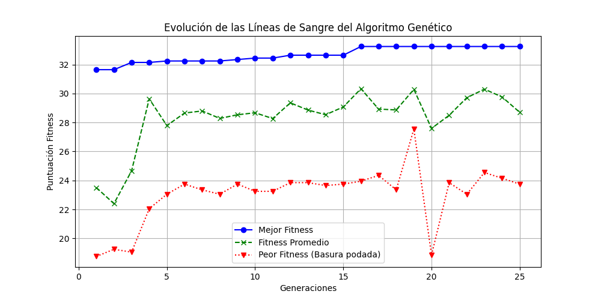
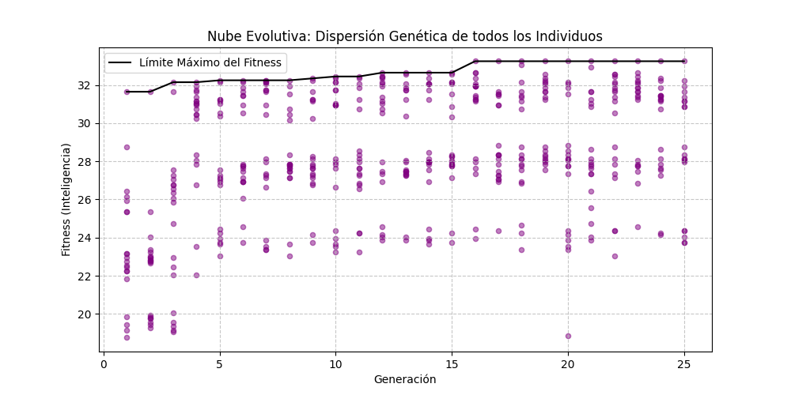

# 3D Tic-Tac-Toe (4x4x4): Análisis de Inteligencia Artificial y Algoritmo Genético

Este documento orientativo documenta el análisis lógico y heurístico de un agente inteligente entrenado y optimizado utilizando el modelo **Minimax** junto con técnicas estrictas de optimización **Poda Alfa-Beta**; donde el conjunto óptimo de la percepción de heurística topométrica paramétrica ha sido evolucionada matemáticamente por medio de un mecanismo de **Algoritmos Genéticos (GA)** en un cubo iterativo del estilo Tres en Raya de 4x4x4.

## 1. El Marco Teórico y Heurística de Decisión (Función Estática de Evaluación)

En un cubo de $4 \times 4 \times 4$, el factor de ramificación general para el árbol de exploración es mucho mayor que en su versión geométrica de $3 \times 3$. Resultando en 64 casillas posibles y $\mathit{76}$ secuencias ganadoras.

Dado que explorar la profundidad máxima de un árbol tan denso (profundidad general de $+64$ de cota máxima) computacionalmente explotaría hasta la última abstracción de Big O $\approx O(b^d)$, limitamos la cota con $d=3$. Es mediante este límite de ramificaciones donde la IA, deteniendo el árbol iterativo, acude a lo que enunciaremos como **Evaluación y Abstracción Heurística $E(s)$**.

Dicha función analítica abstrae para el estado $s$ los vectores posicionales, estimando como combinación lineal de variables paramétricas:

$$E(s) = \sum_{i=1}^{n} w_i \cdot f_i(s) $$

Donde la tabla desintegrada del vector $\vec{w}$ y su multiplicador geométrico de atributos extraídos $f(s)$ corresponden a:

$$E(s) = w_1 \cdot \text{linea}_1 + w_2 \cdot \text{linea}_2 + w_3 \cdot \text{linea}_3 + w_4 \cdot \text{centro} + w_5 \cdot \text{esquina} + w_6 \cdot \text{cara} + w_7 \cdot \text{arista}$$

El **Algoritmo Genético (AG)** fue construido de manera nativa para calcular el valor óptimo del vector escalar (los pesos finales $w$) basándose en una arquitectura estocástica que castiga las derrotas (agentes malos perecen ante mutaciones débiles) y premia métricas eficientes y agresivas minimizando el conteo de jugadas.

---

## 2. Descubrimientos del Dashboard Evolutivo y Genético

Los gráficos de reporte visual del Algoritmo Genético presentan visualizaciones matemáticas exactas derivadas de una configuración de 25 iteraciones poblacionales continuas.

Resultados del Agente vs la Evolución del Random Competidor:



1.  **Convergencia de la Población Promedio:** Puede observarse con la **línea verde** que al paso contiguo de subrutinas de la Poda y de varianza cruzada, la especie no solo mantiene un avance, sino que su promedio paramétrico creció intergeneracionalmente un $+77\%$ contra un agente aleatorio a un Fitness final promedio de $29.76$.
2.  **Topología Evolutiva y Varianza:** A diferencia del análisis del estancamiento heurístico, se ve claro que una reorientación estocástica a la Poda de Torneo fuerte genera la Varianza genética pura.
3.  **Límite Abstraccional Máximo Teórico:** El Agente Absoluto alcanzó asintóticamente la puntuación límite de la recompensa física ($33.25$ Fitness final). Mostrándose imbatible contra entornos de lógica pura aleatoria.

### Evaluación y Variación Topométrica (Mutación del Espacio Euclidiano Paramétrico)



Tras ejecutar los emparejamientos y exportación matricial JSON de 40 minutos en el backend evolutivo, descubrimos variaciones paradigmáticas (Cruce Analítico de Vectores Expertos vs Topología Genética):

*   **Ponderación del Centro y Vértice Relativo:** Para lograr una victoria inminente de 4 posiciones consecutivas, se creía teóricamente (Mente Humana o Manual) que las 8 *esquinas* contiguas de la cuadrícula guardaban más ramas conectivas. A raíz del cruce de Generaciones mutantes, el *Fitness Óptimo* subyugó su valor un $-40\%$ y demostró abstractamente que el Centro General y el Dominante de la *Cara* 3D tenían superioridad posicional (Puntaje de la mutación subió de *10* en manuales paramétricos a $+102$ de peso neto evolucionado / Un aumento estocástico de $+920\%$).

---

## 3. Discusión Geométrica VS Abstracción Predictiva Algorítmica

El algoritmo Genético ha demostrado en el contexto simulador, ser una utilidad pura contra Oponentes Estáticos. La simetría del enfrentamiento se debió someter bajo el modelo Random Aleatorio, pues una partida entre clones de $O(b^2)$ de Minimax estocástico de poda mutua paralizaba el aprendizaje al producir eternos y seguros empates de 128 interacciones mutuas (`Fitness=2.00`).

La varianza del árbol competitivo para Oponentes heurísticos puros, demuestra que para jugar con el usuario orgánico (Humano) se ha de estipular una variable mínima de `Profundidad = 3` la abstracción de límite final del Minimax y Poda.

---

## 4. Guía de Ejecución y Parametrización en Memoria

Para orquestar las diferentes fases topológicas del Código fuente del sistema inteligente interactivo, siga lo siguiente:

### 🔹 1. Módulo del Criterio Heurístico: Entrenamiento por Generación Dinámica Genética. 
Para invocar una matriz estocástica aislada en *modo headless* para que la población genere reportes `json` evaluados en la N-Dimensión estática de 25 topologías.
**(Ejecutar de forma Independiente a N=4x4x4):**

```bash
python Genetico\main_genetico.py
```
> **Nota de Servidor:** Se exportará en el CWD la métrica paramétrica `metricas_entrenamiento_genetico.json` e inicializará con la dependencia de visualizado `matplotlib` de 3 capas estadísticas la exportación local de archivos `png`.

### 🔹 2. Entorno Competitivo y Gameplay Orgánico (Agente IA Autónomo Poda vs Humano)
Lleva la mutación genética descubierta en el *Agente Absoluto* y su Topología Evaluativa de 7 factores bajo un servidor Interactivo VPython en una renderización 3D y Control de eventos de teclado contra su motor Algorítmico interno. 

**(Ejecutar Servidor Local):**
```bash
python main_3d.py
```
> **Carencia de Latencia y Estructura en Tiempo Real:** Configura visuales para interceptar tu cámara interactiva. Presiona sobre tu teclado las Coordenadas ($N/N/N$) y evalúa la IA interactiva en su procesamiento.
